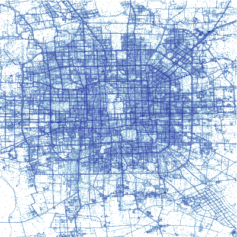

# Trajectory of Taxis

We explore Beijing taxi trip data collected in 2008. This dataset and related publications are at:
https://www.microsoft.com/en-us/research/publication/t-drive-trajectory-data-sample/

There are two iPython notebooks:

+ taxis.ipynb - explore the whole dataset
+ taxi-trajectory.ipynb - analyze an individual trajectory

